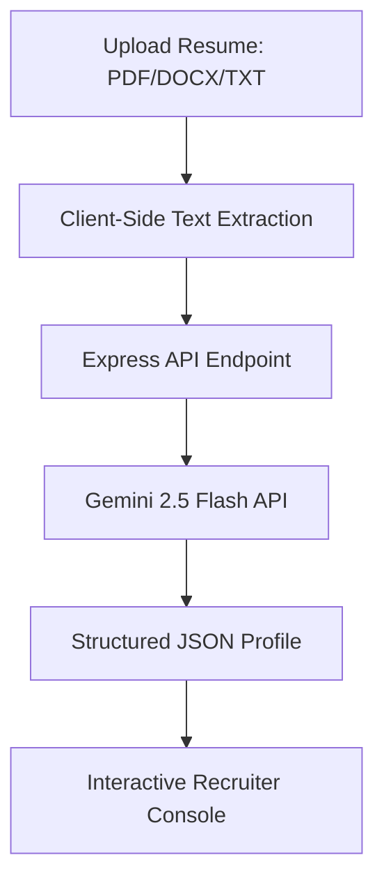

# ResumeAI 🚀

ResumeAI is an intelligent, full-stack resume parsing application designed to automate recruitment workflows. It processes messy resumes (PDF, DOCX, TXT) and transforms them into beautifully structured, queryable candidate profiles in seconds using advanced Large Language Models.

---

## 🌟 How It Works



1. **Upload & Extract**: The user drops a resume into the dashboard. The frontend dynamically parses the text directly in the browser using [PDF.js](https://github.com/mozilla/pdf.js) or [Mammoth.js](https://github.com/mwilliamson/mammoth.js).
2. **AI Structuring**: The extracted text is securely sent to the Node/Express backend, which calls the Google Gemini API with a strict JSON Schema definition.
3. **Instant Preview**: The structured JSON profile (containing experience, projects, skills, contact info, and metrics) is returned and rendered in real-time in the dashboard.

---

## 🛠️ Tech Stack

* **Frontend**: React 19, Vite 8, Tailwind CSS v4, Material Symbols, Glassmorphism UX.
* **Backend**: Node.js, Express, CORS, Dotenv.
* **AI Engine**: Gemini-2.5-Flash (via structured generation config API).
* **Process Manager**: Concurrently (runs frontend & backend in parallel for development).

---

## ✨ What Makes It Unique?

1. **Strict JSON Schema Parsing**: Unlike traditional parsers that rely on fragile regular expressions or keyword matchers, ResumeAI uses Gemini's advanced structural decoding to yield a guaranteed JSON output adhering exactly to the database schema.
2. **AI Executive Summary**: Generates a single, high-impact paragraph summarising the candidate's career highlights and unique selling points, helping recruiters screen profiles in under 5 seconds.
3. **Intelligent Match Rating**: Computes an automated, merit-based compatibility score (0-100) indicating the candidate's alignment with modern tech roles.
4. **Client-Side Pre-processing**: Performs text extraction in the browser to reduce server-side computation, memory footprint, and API payload sizes.
5. **Unified Full-Stack Architecture**: Express is configured to host both the API routes and serve the static React client from the `dist/` directory, enabling one-click hosting on single-service cloud platforms.

---

## 🚀 Running Locally

### 1. Prerequisites
Ensure you have Node.js (v18+) installed.

### 2. Setup Env
Create a `.env` file in the root directory:
```env
GEMINI_API_KEY=your_gemini_api_key_here
PORT=5000
```

### 3. Install & Start
```bash
# Install dependencies
npm install

# Run frontend (Vite) and backend (Express) concurrently
npm run dev
```

Your app will be live at `http://localhost:5173/`.

---

## ☁️ Deployment

This project is optimized for deployment as a single Web Service on **Render** or **Railway**:

1. **Build Command**: `npm install && npm run build`
2. **Start Command**: `npm run server`
3. Add the `GEMINI_API_KEY` environment variable in the dashboard.
